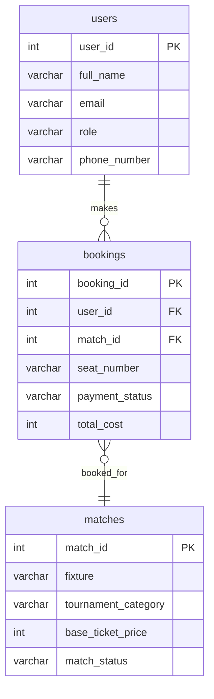

# ⚽ Football Ticket Booking System

This project is a comprehensive database design and SQL querying assignment aimed at evaluating skills in relational database management, ERD architecture, and complex SQL logic within a football ticket booking context.

[](https://www.postgresql.org/)
[](https://www.sqlstandards.org/)

---

## 🛠️ Database Design & Schema Architecture

The system manages football fans, tournament matches, and individual ticket booking receipts, ensuring strict referential integrity.

### 🗄️ ERD Design
🌐 [Live ERD URL](https://lucid.app/lucidchart/a9634acb-c6c3-450b-9342-f35c1f785887/edit?viewport_loc=-184%2C740%2C1859%2C868%2C0_0&invitationId=inv_09bee59c-360f-4d6c-9f73-4df97a369e70)

The system implements the following relationships:
- **One to Many**: One User → Many Bookings.
- **Many to One**: Many Bookings → One Match.
- **One to One (logical)**: Maps user-match-seat selection.



---

## 🎯 SQL Query Objectives

The project includes advanced SQL solutions for:

1.  **Filtering**: Selecting matches by tournament and availability status.
2.  **Pattern Matching**: Using `LIKE`/`ILIKE` for case-insensitive user searches.
3.  **NULL Handling**: Replacing missing payment statuses with 'Action Required' using `COALESCE`.
4.  **Joins**: Utilizing `INNER JOIN` for booking details and `LEFT JOIN` for comprehensive user-booking reports.
5.  **Aggregation & Analysis**: Calculating averages and filtering records using `GROUP BY`, `HAVING`, and subqueries.
6.  **Pagination**: Implementing `OFFSET` and `LIMIT` for result management.

---

## 📂 Project Structure

```text
B7A3_LEVEL2/
├── db.sql               # Schema definition and table creation (DDL)
├── add_on_datas.sql      # Initial sample data (DML)
├── QUERY.sql            # SQL queries addressing assignment requirements
├── README.md            # Project documentation
└── req.md               # Original assignment requirements
```
